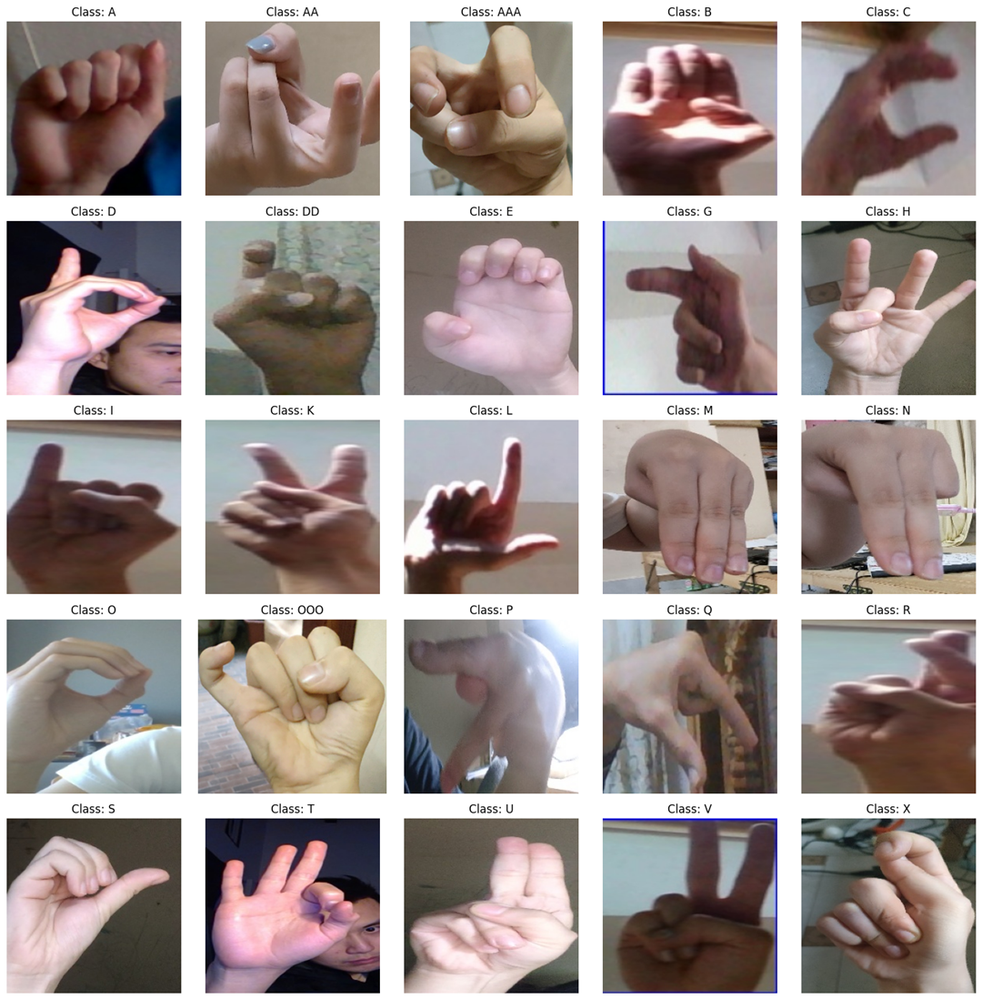
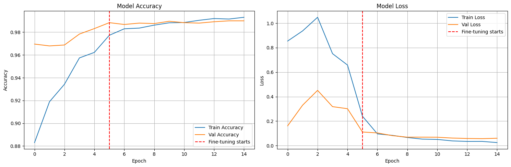
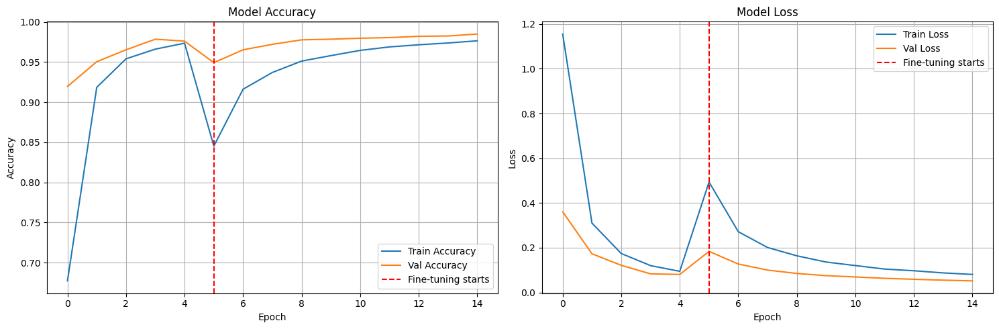
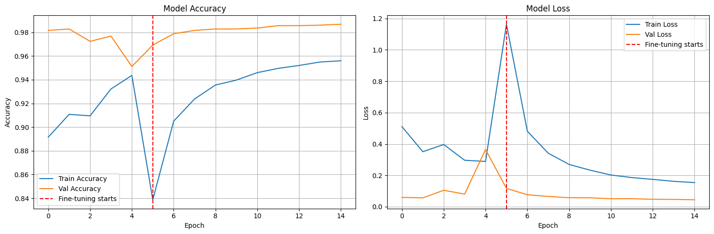

# Dự án phân loại ký hiệu ngôn ngữ ký hiệu Việt Nam

Dự án phân loại ký hiệu ngôn ngữ ký hiệu Việt Nam (Vietnamese Sign Language) sử dụng Deep Learning và Transfer Learning.

<div align="center">
  
  <p><i>Vài mẫu trong bộ dữ liệu VSL</i></p>
</div>

## Tổng quan

Dự án này xây dựng mô hình phân loại 25 ký hiệu chữ cái trong ngôn ngữ ký hiệu Việt Nam sử dụng các kiến trúc mạng nơ-ron tích chập (CNN) tiên tiến thông qua kỹ thuật Transfer Learning.

### Bộ dữ liệu

- **Nguồn**: [Kaggle - Vietnamese Sign Language Dataset](https://www.kaggle.com/datasets/mcphngnga/dataset-vsl/data)
- **Tổng số ảnh**: 25,000 ảnh (sau khi xử lý trùng lặp)
- **Số lớp**: 25 ký hiệu (A, AA, B, C, D, DD, E, G, H, I, K, L, M, N, O, OOO, P, Q, R, S, T, U, V, X, Y)
- **Kích thước ảnh**: 224x224 pixels
- **Định dạng**: PNG

**Phân chia dữ liệu:**

- Train: 20,000 ảnh (80%)
- Validation: 2,496 ảnh (10%)
- Test: 2,504 ảnh (10%)

### Các mô hình được triển khai

| Mô hình       | Test Accuracy | Test Loss | Số Parameters | Kích thước |
| ------------- | ------------- | --------- | ------------- | ---------- |
| **VGG16**     | **99.00%**    | 0.0678    | 27.6M         | 105 MB     |
| **ResNet50**  | **98.96%**    | 0.0402    | ~25M          | ~98 MB     |
| **MobileNet** | **98.80%**    | 0.0519    | ~4.2M         | ~16 MB     |

**Nhận xét:**

- **VGG16** đạt độ chính xác cao nhất (99.00%) nhưng có kích thước lớn nhất
- **ResNet50** cân bằng tốt giữa độ chính xác và kích thước mô hình
- **MobileNet** nhẹ nhất, phù hợp cho triển khai trên thiết bị di động

## Cấu trúc thư mục

```
Classification-of-Vietnamese-Sign-Language/
├── notebooks/              # Jupyter notebooks
│   ├── VLS_train_val_test.ipynb           # Tiền xử lý và chia dữ liệu
│   ├── data_visualization.ipynb           # Khám phá và trực quan hóa dữ liệu
│   ├── transfer_learning_resnet50.ipynb   # Huấn luyện ResNet50
│   ├── transfer_learning_vgg16.ipynb      # Huấn luyện VGG16
│   └── transfer_learning_mobilenet.ipynb  # Huấn luyện MobileNet
├── models/                 # Mô hình đã huấn luyện (lưu trên Drive)
├── reports/                # Báo cáo và tài liệu
│   ├── figures/           # Hình ảnh và biểu đồ
│   ├── 1. Phần tổng quan về dữ liệu.md
│   ├── 2. Tiền xử lý dữ liệu.md
│   └── 3. Lý thuyết mạng ResNet50.md
└── README.md
```

## Kết quả

### So sánh các mô hình

| Mô hình       | Test Accuracy | Test Loss | Val Accuracy | Số Parameters | Thời gian huấn luyện |
| ------------- | ------------- | --------- | ------------ | ------------- | -------------------- |
| **VGG16**     | **99.00%**    | 0.0678    | 99.00%       | 27.6M         | ~60 phút             |
| **ResNet50**  | **98.96%**    | 0.0402    | 98.48%       | ~25M          | ~35 phút             |
| **MobileNet** | **98.80%**    | 0.0519    | 98.68%       | ~4.2M         | ~15 phút             |

**Phân tích:**

- **VGG16**: Đạt độ chính xác cao nhất nhưng tốn nhiều thời gian huấn luyện và bộ nhớ
- **ResNet50**: Loss thấp nhất, cân bằng tốt giữa hiệu suất và tốc độ
- **MobileNet**: Nhanh nhất, nhẹ nhất, phù hợp cho ứng dụng thực tế trên mobile

### Chi tiết từng mô hình

#### 1. VGG16

- **Test Accuracy**: 99.00%
- **Test Loss**: 0.0678
- **Kiến trúc**: VGG16 pretrained trên ImageNet
- **Đặc điểm**: Kiến trúc đơn giản, nhiều tham số, độ chính xác cao nhất

#### 2. ResNet50

- **Test Accuracy**: 98.96%
- **Test Loss**: 0.0402
- **Kiến trúc**: ResNet50 pretrained trên ImageNet với skip connections
- **Đặc điểm**: Loss thấp nhất, huấn luyện ổn định nhờ residual connections

#### 3. MobileNet

- **Test Accuracy**: 98.80%
- **Test Loss**: 0.0519
- **Kiến trúc**: MobileNetV1 với depthwise separable convolutions
- **Đặc điểm**: Nhẹ nhất (4.2M params), tốc độ inference nhanh

### Phương pháp huấn luyện chung

Tất cả các mô hình đều sử dụng chiến lược huấn luyện 2 giai đoạn:

**Giai đoạn 1 - Warmup (5 epochs):**

- Đóng băng base model
- Chỉ huấn luyện lớp phân loại
- Adam optimizer với learning rate warmup (0.0003 → 0.001)

**Giai đoạn 2 - Fine-tuning (10 epochs):**

- Mở băng toàn bộ mô hình
- SGD optimizer với momentum 0.9
- Learning rate: 1e-5
- Callbacks: EarlyStopping, ReduceLROnPlateau

### Kỹ thuật được sử dụng

- **Transfer Learning**: Sử dụng mô hình pretrained trên ImageNet
- **Data Augmentation**: Random flip, brightness, contrast
- **Callbacks**:
  - Learning Rate Scheduler (Warmup)
  - Early Stopping
  - ReduceLROnPlateau
- **Optimization**:
  - Adam optimizer (giai đoạn warmup)
  - SGD với momentum (giai đoạn fine-tuning)

## Yêu cầu hệ thống

### Thư viện Python

```
tensorflow>=2.10.0
numpy>=1.21.0
matplotlib>=3.5.0
pandas>=1.3.0
scikit-learn>=1.0.0
```

### Môi trường

- Python 3.8+
- Google Colab (khuyến nghị cho GPU)
- Google Drive (để lưu trữ dữ liệu và mô hình)

## Hướng dẫn sử dụng

### 1. Chuẩn bị dữ liệu

```python
# Chạy notebook VLS_train_val_test.ipynb
# Notebook này sẽ:
# - Tải dữ liệu từ Kaggle
# - Xử lý dữ liệu trùng lặp (loại bỏ class AAA)
# - Chia dữ liệu thành train/val/test
# - Lưu dữ liệu dưới dạng TFRecord (nén GZIP)
```

### 2. Khám phá dữ liệu

```python
# Chạy notebook data_visualization.ipynb
# Xem phân bố dữ liệu, kích thước ảnh, và mẫu ảnh
```

### 3. Huấn luyện mô hình

Chọn một trong các notebook tùy theo mô hình muốn huấn luyện:

```python
# VGG16 - Độ chính xác cao nhất (99.00%)
# Chạy notebook: transfer_learning_vgg16.ipynb

# ResNet50 - Cân bằng tốt (98.96%)
# Chạy notebook: transfer_learning_resnet50.ipynb

# MobileNet - Nhẹ nhất cho mobile (98.80%)
# Chạy notebook: transfer_learning_mobilenet.ipynb
```

### 4. Đánh giá và dự đoán

Mô hình đã được đánh giá trên tập test và có thể sử dụng để dự đoán:

```python
import tensorflow as tf

# Load mô hình (chọn một trong ba)
model_vgg16 = tf.keras.models.load_model('path/to/vgg16_vsl.keras')
model_resnet50 = tf.keras.models.load_model('path/to/resnet50_vsl.keras')
model_mobilenet = tf.keras.models.load_model('path/to/mobilenet_vsl.keras')

# Dự đoán
predictions = model.predict(preprocessed_images)
predicted_class = class_names[np.argmax(predictions[0])]
```

## Tiền xử lý dữ liệu

### Xử lý dữ liệu trùng lặp

- Loại bỏ class **AAA** do trùng lặp với class **AA**
- Giảm từ 26 classes xuống 25 classes

### Lưu trữ tối ưu

Dữ liệu được lưu dưới dạng **TFRecord** với nén GZIP:

- Dung lượng gốc (dataset.save()): ~14 GB
- Dung lượng sau nén (TFRecord + GZIP): ~313 MB
- **Tiết kiệm**: ~97.8%

### Data Augmentation

- Random horizontal flip
- Random brightness adjustment (±20%)
- Random contrast adjustment (0.8-1.2)

## Kết quả chi tiết

### So sánh biểu đồ huấn luyện

#### VGG16 - Accuracy: 99.00%

<div align="center">
  
  <p><i>Quá trình huấn luyện VGG16: Đạt validation accuracy 99.00% sau 15 epochs</i></p>
</div>

#### ResNet50 - Accuracy: 98.96%

<div align="center">
  
  <p><i>Quá trình huấn luyện ResNet50: Loss thấp nhất (0.0402) với huấn luyện ổn định</i></p>
</div>

#### MobileNet - Accuracy: 98.80%

<div align="center">
  
  <p><i>Quá trình huấn luyện MobileNet: Nhanh nhất với 4.2M parameters</i></p>
</div>

## Tác giả

NTTU - Nguyễn Xuân Tiến & Đồng Nguyễn Xuân An

## Tài liệu tham khảo

1. He, K., Zhang, X., Ren, S., & Sun, J. (2016). Deep residual learning for image recognition. CVPR.
2. Simonyan, K., & Zisserman, A. (2014). Very deep convolutional networks for large-scale image recognition. ICLR.
3. Howard, A. G., et al. (2017). MobileNets: Efficient convolutional neural networks for mobile vision applications. arXiv.
4. Vietnamese Sign Language Dataset - Kaggle

## License

Dự án này được sử dụng cho mục đích học tập và nghiên cứu.

---

**Lưu ý**: Các mô hình đã huấn luyện được lưu trữ trên Google Drive do kích thước lớn. Xem file `models/Link (do cac files kha nang).txt` để biết thêm chi tiết.
