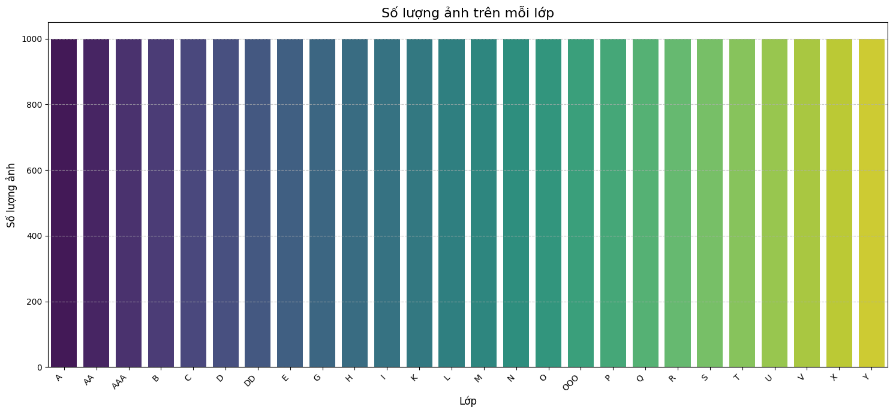
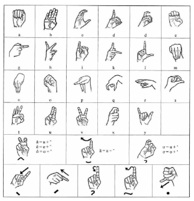
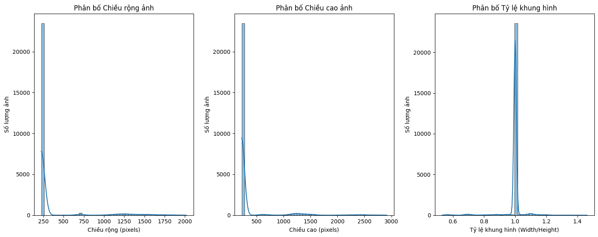
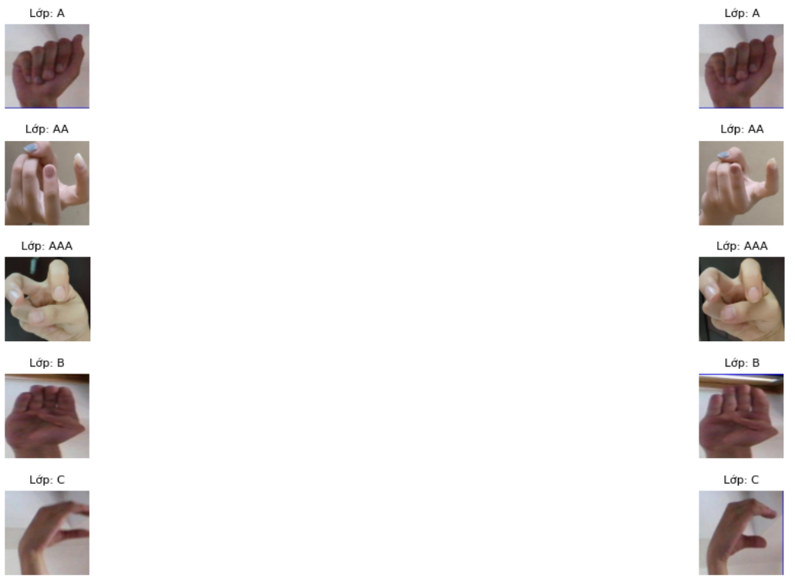

Bộ dữ liệu được tổng hợp từ nhiều nguồn khác nhau phục vụ cho nghiên cứu về bài toán nhận diện ký hiệu tiếng việt được chia sẻ trên [Kaggle](https://www.kaggle.com/datasets/mcphngnga/dataset-vsl/data), bao gồm 26.000 bức ảnh về cử chỉ tay đại diện cho 26 ký hiệu (1 ký hiệu chứa 1000 bức). 26 ký tự đó bao gồm A, AA, AAA, B, C, D, DD, E, G, H, I, K, L, M, N, O, OOO, P, Q, R, S, T, U, V, X, Y.

  
  
<i>Hình 1: Số lượng ảnh trên mỗi lớp</i>

**Đặc điểm về bộ dữ liệu:**
- Tất cả ảnh đều có định dạng là .pnj.
- Các lớp đặc biệt AA (Â), AAA (Ă), OOO (Ơ).
- Bộ dữ liệu này đã được tăng cường dữ liệu thông qua các kỹ thuật như nén ảnh, thay đổi độ tương phản.
- Không có dữ liệu cho các ký hiệu dấu nhấn và dấu thanh như  Ê, Ô, Ư, dấu huyền, dấu sắc, dấu hỏi, dẫu ngã và dấu nặng.

  
  
<i>Hình 2: Vietnamese sign language alphabet</i>

**Kích thước và tỉ lệ của ảnh:** 

  
  
<i>Hình 3: Phân bố chiều rộng và chiều cao của ảnh</i>

- Biểu đồ phân phối chiều chiều rộng và chiều cao ảnh đều hiển thị một đỉnh rất cao và rõ ràng tại 224 pixels. Điều này xác nhận rằng đại đa số các ảnh trong dataset đã được resize thành 224x224 pixels. Ngoài ra, có một số lượng nhỏ các ảnh có kích thước lớn hơn, tạo thành các phân bố kéo dài về phía bên phải, nhưng chúng ít nổi bật hơn nhiều so với đỉnh 224.

  
  
<i>Hình 4: Hiển thị ảnh trong 5 lớp đầu tiên  </i>

